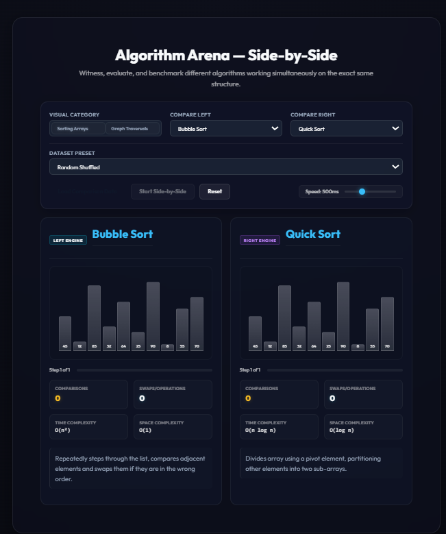
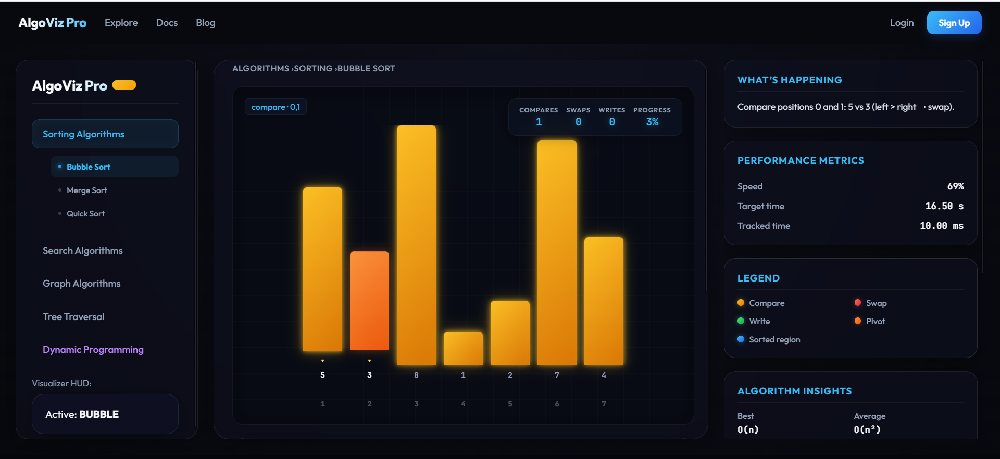
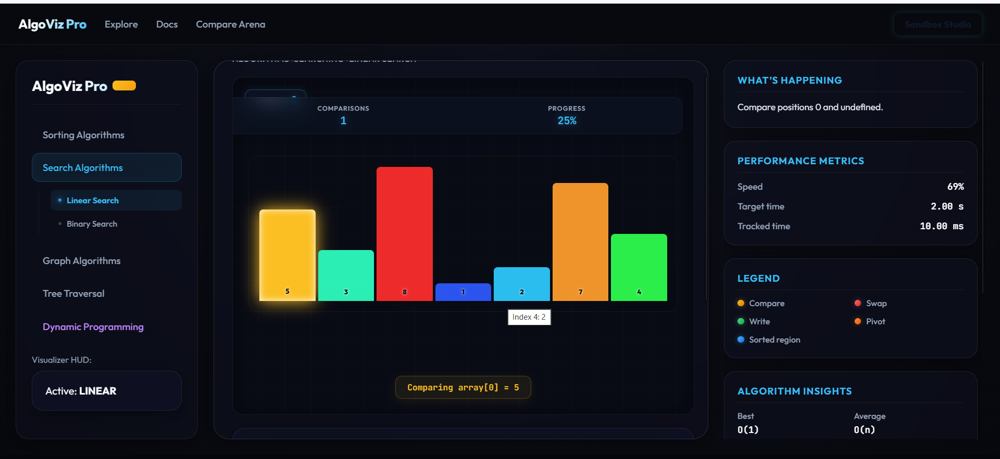
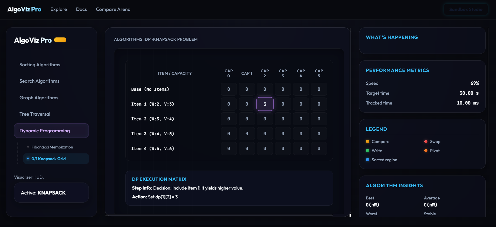
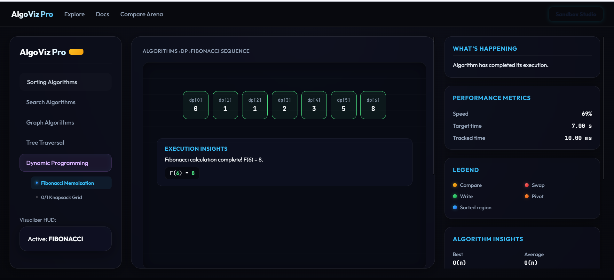

# 🌌 AlgoViz Pro — Advanced Algorithm Visualizer & Sandbox Playroom

[](https://react.dev/)
[](https://flask.palletsprojects.com/)
[](https://d3js.org/)
[](https://opensource.org/licenses/MIT)

**AlgoViz Pro** is an elite, highly interactive, and visually stunning web platform designed to bring computer science concepts to life. Combining an intuitive React/Vite client with a robust Flask computational engine, it renders complex sorting arrays, recursive trees, weighted graphs, and dynamic programming matrices with professional neon aesthetics.

---

## 🎨 Project Visual Gallery

### 1. ⚔️ The Algorithm Arena

> **Dual-Engine Benchmark Console**: A side-by-side performance comparator designed to evaluate two different algorithms running concurrently on identical input datasets. This interface displays split ticking panels, dual execution logs, and active memory structures in real time. It visually maps queue (FIFO) and stack (LIFO) allocations during traversals, highlighting the spatial and temporal efficiency differences between algorithms like Quick Sort and Bubble Sort or BFS and DFS in an engaging, interactive way.

### 2. 📊 Sorting Spectrograms

> **Interactive Value Spectrogram**: Maps array values to customizable bar heights and dynamic color spectrums. As sorting algorithms process the array, elements dynamically transition across color-coded state classes: bright yellow for active comparisons, deep emerald green for swaps, and signature neon cyan for sorted states. This layout delivers instant spatial feedback on how partitioning pivots rearrange data pools in real time.

### 3. 📉 Linear Sorting Layouts

> **Element Evaluation Grid**: A specialized step-by-step index strip that maps sorted states onto a clean linear index timeline. Unlike height-based bars, the linear strip focuses heavily on item exchanges, pivot boundaries, and partitioning thresholds. It helps developers and students understand the precise in-place sub-array subdivisions of complex sorting systems without height-based distractions.

### 4. 🎒 Dynamic Programming (0/1 Knapsack)

> **DP Matrix Solver**: An interactive dynamic programming grid built specifically for the 0/1 Knapsack solver. The system compiles a real-time matrix grid showing exactly how intermediate sub-problems are computed ($dp[i][w]$). Active cell dependency indicators glow yellow when referenced, revealing how the system builds on previously computed cells. Once completed, the optimal backtrack solution is illuminated in glowing gold.

### 5. 🌲 Recursive Fibonacci Trees

> **Recursive Tree Call-Stack Map**: A layered mathematical tree visualizer mapping recursive call-stack evaluations during Fibonacci calculations. Each recursive call is rendered as a tree node connected by smooth Bezier link lines. Active branches glow yellow during evaluation, green upon successful calculation, and blue when returning values. This visualizer solves the "black box" problem of recursion, allowing users to watch the call stack expand and retract.

---

## 🚀 Key Architectural Modules

### 1. 🎨 The Canvas Stage
Powered by D3.js and HTML5, the canvas renders graphs, trees, and matrices using rich, harmonized design system tokens.
*   **Visual Themes**: Toggle dynamically between **Neon Aura**, **Chroma Spectrogram**, and **Radial Pulse** visualization modes.
*   **Smooth Micro-Animations**: Force-directed simulations and smooth transitions make node movements feel alive.
*   **Synthesized Voice Console**: Uses browser Speech Synthesis to audibly narrate visualization steps and algorithmic logic in real time.

### 2. ⚔️ Dual-Engine Algorithm Arena
Benchmark sorting algorithms or graph traversals side-by-side.
*   **Synchronized Ticking**: Execute both algorithms concurrently at customizable speeds (from `50ms` up to `1500ms`).
*   **Interactive Queues/Stacks**: Watch data structure memory pools (FIFO queues and LIFO stacks) expand and pop items step-by-step.
*   **Benchmark Telemetry**: Compare counts of element comparisons, swaps, operations, and theoretical complexities side-by-side.

### 3. 🎨 Sandbox Studio Playground
Design and evaluate custom datasets with complete creative freedom.
*   **JSON Topology Compiler**: Text workspace to build custom graph adjacency lists with real-time JSON format linting.
*   **Template Generators**: Inject Ring, Mesh, or Binary Search Tree templates with a single click.
*   **Design Token Tuner**: Sliders to adjust design parameters: node sizing, neon glow radius, and primary hex accent color.

---

## 📂 Project Hierarchy

```bash
algoviz-pro/
├── backend/                   # Flask Python Backend Server
│   ├── algorithms/            # Core Algorithmic Engines
│   │   ├── sorting.py         # Bubble, Quick, and Merge Sort
│   │   ├── graph.py           # BFS, DFS, Dijkstra, and Prim's MST
│   │   └── math_algos.py      # Fibonacci and 0/1 Knapsack Solver
│   ├── app.py                 # Flask Main Endpoint Server
│   └── requirements.txt       # Python Requirements
│
├── frontend/                  # React Vite Frontend Client
│   ├── src/
│   │   ├── components/        # UI Primitives & Core Layouts
│   │   │   ├── Header.jsx
│   │   │   ├── Sidebar.jsx
│   │   │   ├── GraphVisualization.jsx
│   │   │   └── MainLayout.jsx
│   │   ├── pages/             # Main Application Routes
│   │   │   ├── Explore.jsx
│   │   │   ├── Docs.jsx
│   │   │   ├── Compare.jsx    # Dual Visualizer benchmark arena
│   │   │   └── Sandbox.jsx    # Custom JSON designer playroom
│   │   ├── App.jsx            # Routing & Global Visualizer Hub
│   │   └── main.jsx
│   ├── package.json
│   └── vite.config.js
│
└── assets/                    # Consolidated Visual Showcase Assets
    ├── compare.png
    ├── sorting.png
    ├── linearsort.png
    ├── knapsack.png
    └── fibonacci.png
```

---

## 🛠️ Step-by-Step Installation

### 1. Prerequisite Environments
*   **Node.js**: Version 16.x or newer.
*   **Python**: Version 3.10 or newer.

---

### 2. Computational Backend (Flask)

1. Navigate to the backend directory:
   ```bash
   cd backend
   ```

2. Create and activate a Python virtual environment:
   ```bash
   # Windows PowerShell
   python -m venv venv
   .\venv\Scripts\Activate.ps1
   
   # macOS/Linux
   python3 -m venv venv
   source venv/bin/activate
   ```

3. Install required Python packages:
   ```bash
   pip install -r requirements.txt
   ```

4. Launch the backend API server:
   ```bash
   python app.py
   ```
   *The Flask server will boot on **`http://localhost:5000`**.*

---

### 3. Interactive Frontend Client (React)

1. Navigate to the frontend directory:
   ```bash
   cd ../frontend
   ```

2. Install Node dependencies:
   ```bash
   npm install
   ```

3. Start the Vite hot-reloading development server:
   ```bash
   npm run dev
   ```
   *Open **`http://localhost:5173`** (or `http://localhost:5174`) in your browser.*

---

## 📘 Supported Algorithms & Mappings

| Category | Algorithm | Visual Style | Complexities (Avg) |
| :--- | :--- | :--- | :--- |
| **Sorting** | Bubble Sort | Responsive vertical spectrogram bars | $O(n^2)$ |
| **Sorting** | Quick Sort | Active partitioning pivot focus bars | $O(n \log n)$ |
| **Sorting** | Merge Sort | Sub-array division mapping | $O(n \log n)$ |
| **Graph** | Breadth-First Search | Connected nodes + Queue tracking | $O(V + E)$ |
| **Graph** | Depth-First Search | Connected nodes + Stack tracking | $O(V + E)$ |
| **Graph** | Dijkstra | Shortest path glowing routes | $O((V+E)\log V)$ |
| **Graph** | Prim's MST | Minimum Spanning Tree neon routes | $O(E \log V)$ |
| **Dynamic Prog** | 0/1 Knapsack | Auto-building tabular dynamic grid | $O(n \cdot W)$ |
| **Recursion** | Fibonacci Tree | Layered tree call-stack graphs | $O(2^n)$ |

---

## 🌟 Visual Theme Spectrograph Modes

Modify the visualizer experience with pre-configured aesthetics:
1.  **Neon Aura**: Glowing high-contrast network lines designed for dark ambient environments.
2.  **Chroma Spectrogram**: Renders element values based on a smooth HSL color wheel sequence.
3.  **Radial Pulse**: Nodes emit soft pulse waves representing current discovery actions.

---

*Developed with ❤️ by the M Rashid Shafique.*
